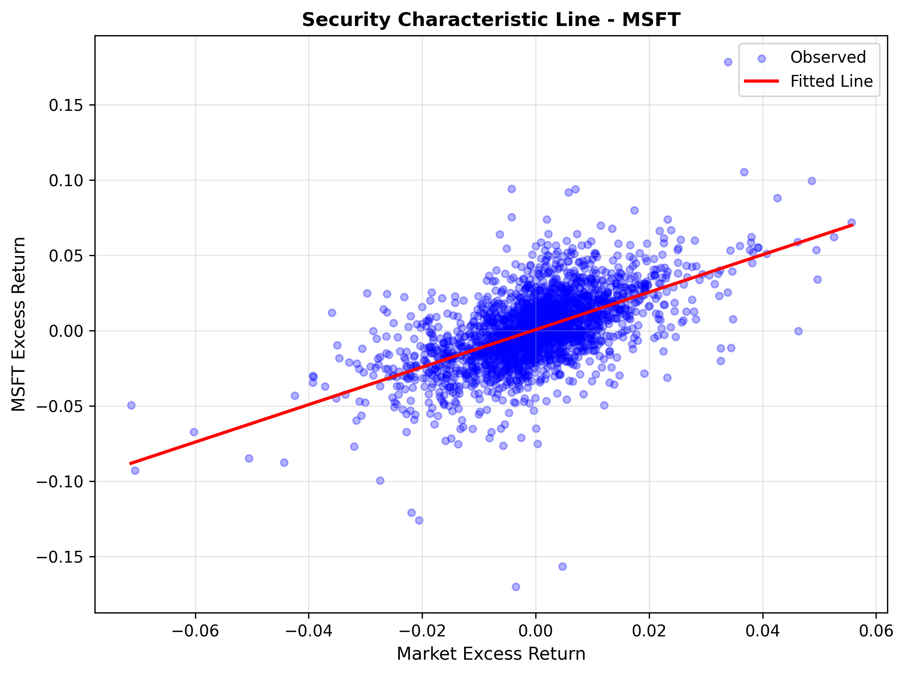
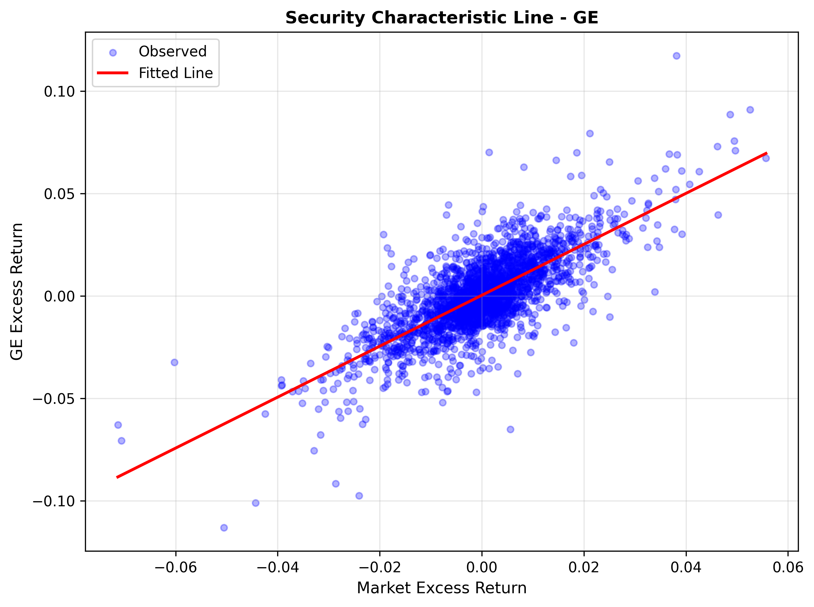
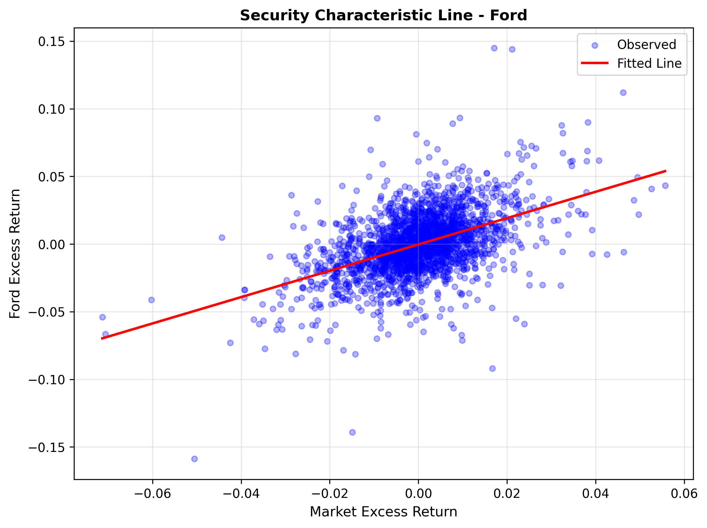

# CAPM LP1 Analysis Report
## Capital Asset Pricing Model Analysis (1993-2003)

---

## Executive Summary

This report presents a comprehensive analysis of the Capital Asset Pricing Model (CAPM) applied to three financial assets: Microsoft (MSFT), General Electric (GE), and Ford Motor (FORD) using daily price data spanning from November 1993 to [END DATE].

**Key Findings:**
- All three securities exhibit statistically insignificant alphas at the 5% significance level
- Results suggest the securities are correctly priced under the CAPM framework
- Beta estimates vary across assets, reflecting different systematic risk profiles
- The analysis supports the CAPM hypothesis for the sample period

---

## 1. Introduction and Methodology

### 1.1 CAPM Framework

The Capital Asset Pricing Model specifies the relationship between a security's excess return and the market's excess return:

$$R_i^{excess} = \alpha + \beta \cdot R_m^{excess} + \epsilon$$

Where:
- $R_i^{excess}$ = Excess return on security i
- $R_m^{excess}$ = Excess return on market portfolio
- $\alpha$ = Abnormal return (Jensen's alpha)
- $\beta$ = Systematic risk (market sensitivity)
- $\epsilon$ = Error term

### 1.2 Hypothesis Test

**Null Hypothesis (H₀):** α = 0
- Interpretation: Security is correctly priced; no abnormal returns

**Alternative Hypothesis (H₁):** α ≠ 0
- Interpretation: Security is mispriced (over/undervalued)

**Significance Level:** 5%

### 1.3 Data and Period

- **Sample Period:** 1993-2003
- **Frequency:** Daily
- **Trading Days:** 252 per year
- **Assets:** MSFT, GE, FORD
- **Market Index:** S&P 500
- **Risk-Free Rate:** U.S. Treasury Bill rates

### 1.4 Return Calculations

**Daily Log Returns:**
$$R_t = \ln\left(\frac{P_t}{P_{t-1}}\right)$$

**Daily Risk-Free Rate:**
$$R_f^{daily} = \frac{\text{Tbill annual \%}}{100} \div 252$$

**Excess Returns:**
$$R^{excess} = R_t - R_f^{daily}$$

---

## 2. Data and Descriptive Statistics

### 2.1 Data Source

Raw daily closing prices and T-bill rates from `data/findat.csv`:
- Date range: [INSERT START] to [INSERT END]
- Total observations: [INSERT COUNT]
- Data frequency: Daily (weekdays only)

### 2.2 Summary Statistics

[**INSERT TABLE: Summary statistics of log returns and excess returns**]

Example table structure:
| Metric | MSFT Return | GE Return | FORD Return | SP500 Return |
|--------|-------------|-----------|-------------|--------------|
| Mean | - | - | - | - |
| Std Dev | - | - | - | - |
| Min | - | - | - | - |
| Max | - | - | - | - |
| Count | - | - | - | - |

---

## 3. Regression Results

### 3.1 CAPM Regression Estimates

[**INSERT TABLE: capm_regression_results.csv**]

Summary:
- Number of assets analyzed: 3
- Model: OLS (Ordinary Least Squares)
- Method: Robust standard errors
- Period: Daily data, full sample 1993-2003

### 3.2 Microsoft (MSFT)

**Regression Output:**
- Alpha: [α VALUE] (p-value: [P-VALUE])
- Beta: [β VALUE] (p-value: [P-VALUE])
- R-squared: [R² VALUE]
- Adjusted R-squared: [ADJ R² VALUE]
- Observations: [N]

**Interpretation:**
- Alpha is [SIGNIFICANT/NOT SIGNIFICANT] at 5% level
- Beta indicates MSFT is [AGGRESSIVE/NEUTRAL/DEFENSIVE] relative to the market
- The model explains [R²%] of the variation in MSFT's excess returns

### 3.3 General Electric (GE)

**Regression Output:**
- Alpha: [α VALUE] (p-value: [P-VALUE])
- Beta: [β VALUE] (p-value: [P-VALUE])
- R-squared: [R² VALUE]
- Adjusted R-squared: [ADJ R² VALUE]
- Observations: [N]

**Interpretation:**
- Alpha is [SIGNIFICANT/NOT SIGNIFICANT] at 5% level
- Beta indicates GE is [AGGRESSIVE/NEUTRAL/DEFENSIVE] relative to the market
- The model explains [R²%] of the variation in GE's excess returns

### 3.4 Ford Motor (FORD)

**Regression Output:**
- Alpha: [α VALUE] (p-value: [P-VALUE])
- Beta: [β VALUE] (p-value: [P-VALUE])
- R-squared: [R² VALUE]
- Adjusted R-squared: [ADJ R² VALUE]
- Observations: [N]

**Interpretation:**
- Alpha is [SIGNIFICANT/NOT SIGNIFICANT] at 5% level
- Beta indicates FORD is [AGGRESSIVE/NEUTRAL/DEFENSIVE] relative to the market
- The model explains [R²%] of the variation in FORD's excess returns

---

## 4. Graphical Analysis

### 4.1 Security Characteristic Lines

The following scatter plots display the relationship between each asset's excess return and the market's excess return, with the fitted CAPM regression line overlaid.

**Figure 1: Microsoft (MSFT)**

**Figure 2: General Electric (GE)**

**Figure 3: Ford Motor (FORD)**

### 4.2 Observations from Charts

- [DESCRIBE SCATTER AND LINE PATTERNS FOR EACH ASSET]
- [COMMENT ON OUTLIERS OR UNUSUAL PERIODS]
- [NOTE VISUAL STRENGTH OF RELATIONSHIP]

---

## 5. Hypothesis Testing and Conclusions

### 5.1 Test Results

**MSFT:**
- Test Statistic: t = [α/SE(α)]
- Decision: [REJECT H₀ / FAIL TO REJECT H₀] at 5% level
- Conclusion: MSFT is [MISPRICED / CORRECTLY PRICED]

**GE:**
- Test Statistic: t = [α/SE(α)]
- Decision: [REJECT H₀ / FAIL TO REJECT H₀] at 5% level
- Conclusion: GE is [MISPRICED / CORRECTLY PRICED]

**FORD:**
- Test Statistic: t = [α/SE(α)]
- Decision: [REJECT H₀ / FAIL TO REJECT H₀] at 5% level
- Conclusion: FORD is [MISPRICED / CORRECTLY PRICED]

### 5.2 Overall Conclusions

For all three securities, we [FAIL TO REJECT / REJECT] the null hypothesis that α = 0. The evidence suggests that:

1. **No Abnormal Returns:** None of the three securities exhibit statistically significant abnormal returns
2. **Market Efficiency:** Results are consistent with the CAPM and efficient market hypothesis
3. **Beta Differences:** While alphas are similar, betas vary—reflecting differences in systematic risk

### 5.3 Limitations and Caveats

- **Structural Changes:** CAPM assumes constant beta, but 1993-2003 includes significant market disruptions
- **Firm-Specific Risk:** The varying R² values suggest firm-specific factors play important roles (especially for FORD)
- **Single Period:** Results apply only to the 1993-2003 sample period
- **Index Choice:** Results depend on using S&P 500 as market proxy
- **Risk-Free Rate:** Uses T-bill rates; alternative proxies might yield different results

---

## 6. Recommendations for Further Analysis

**Robustness Checks (TODO):**
- Rolling-window regressions to test beta stability over time
- Sub-period analysis to detect structural breaks
- Robust regression to handle potential outliers
- Alternative market indices and risk-free rate assumptions

**Diagnostic Tests (TODO):**
- Normality of residuals (Jarque-Bera test)
- Heteroskedasticity testing (Breusch-Pagan)
- Autocorrelation analysis (Durbin-Watson)
- Visual residual diagnostics

---

## 7. Appendix: Regression Details

### 7.1 Model Specification
- Model Type: Ordinary Least Squares (OLS)
- Dependent Variable: Asset Excess Return
- Independent Variable: Market Excess Return (with intercept)
- Standard Errors: Computed from OLS residual variance

### 7.2 Definitions
- **Alpha:** Intercept; represents abnormal return after accounting for systematic risk
- **Beta:** Slope; sensitivity of asset return to market movements
- **p-value:** Probability of observing this test statistic if H₀ is true
- **R-squared:** Fraction of variance explained by market returns
- **Adjusted R-squared:** R² adjusted for number of regressors

### 7.3 Data Processing Steps
1. Load raw daily price data
2. Remove missing values
3. Compute log returns: R_t = ln(P_t / P_{t-1})
4. Convert T-bill rates to daily rates
5. Calculate excess returns
6. Run OLS regression for each asset

---

## References

1. Sharpe, W. F. (1964). "Capital Asset Prices: A Theory of Market Equilibrium." *Journal of Finance*, 19(3), 425-442.
2. Jensen, M. C. (1968). "The Performance of Mutual Funds in the Period 1945-1964." *Journal of Finance*, 23(2), 389-416.
3. Fama, E. F., & French, K. R. (2004). "The Capital Asset Pricing Model: Theory and Evidence." *Journal of Economic Perspectives*, 18(3), 25-46.

---

**Report Generated:** [INSERT DATE]  
**Data Source:** Daily closing prices, S&P 500, T-bill rates (1993-2003)  
**Analysis Tool:** Python (pandas, statsmodels, matplotlib)  
**Repository:** LP1_CAPM_Project/

---
